# BACKGAMMON 🧅 🎲


A multiplayer backgammon game implementation with secure communication using **onion routing**🧅 and **encryption**.

## Features

- Multiplayer backgammon game with real-time gameplay
- Graphical user interface built with Pygame
- Secure communication using onion routing architecture
- End-to-end encryption for all game messages
- In-game chat system
- Real-time dice rolling
- Player matching system

## Technical Implementation

### Server
- Implements onion routing with multiple relay nodes
- Handles player matchmaking and game state management
- Manages secure key exchange between clients
- Controls dice rolling to ensure fair gameplay

### Client
- GUI built with Pygame showing the game board, pieces, and dice
- Implements move validation and game rules
- Handles encrypted communication through the onion network
- Supports player-to-player chat

## Security Features

- Multi-layer encryption using onion routing
- Secure key exchange protocol
- Encrypted client-to-client communication
- Protected game state transmission

## How to Run

1. Start the server:
```bash
python server.py
```

2. Start client instances (can run multiple):
```bash
python client.py
```

3. Connect with other players using their port numbers

## Gameplay Instructions

1. Wait for the game to match you with an opponent
2. White pieces move clockwise, Black pieces move counter-clockwise
3. Click your pieces and valid destination points to move
4. Use the chat feature to communicate with your opponent
5. Game ends when one player moves all pieces to their home board and bears off

---
# WireShark 🦈

## Handshake

At first the Server receives a SYN flag with 0 len. This shows that a socket is trying to handshake
The server gets this SYN and sends back a [SYN, ACK] to the socket
Then the client sends back an ACK.
3-way handshaking is done.
we can see that by using the tcp.port in {5053} filter
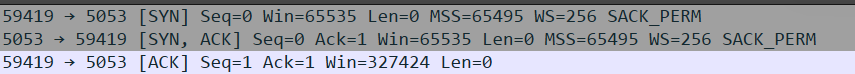

The server gets a packet with [PSH, ACK] and seq=1 with len=27 that shows the next sequence# will be 28
The server send back an ACK with ack# of 28
The client sends the sequence# of 28 with len 30
The server send back an ACK with ack# of 58

The client and the server send their receiver windows to eachother in each message.

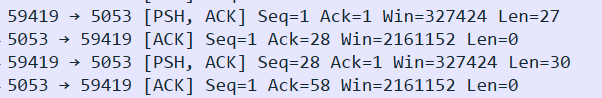
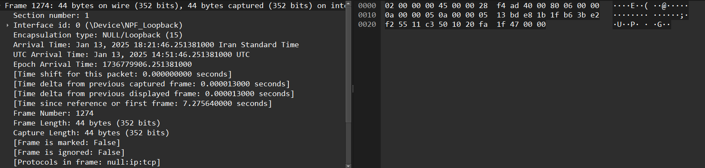
- ### [PRIVATE KEY 0]
#### The user communicates with the first router:
  
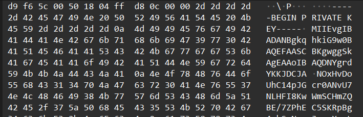

#### The router sends a success message back to the user:
  
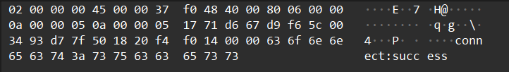

- ### [PRIVATE KEY 1]
#### The user sends encrypted chunks to the first router:

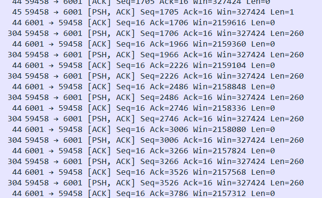

#### The first router assembles the chunks, decrypts them, and forwards the data to the second router.
#### second router recieving the key
  
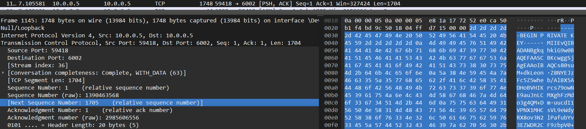

#### sending success back to user
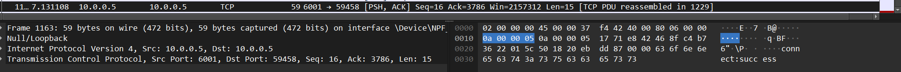

- ### [PRIVATE KEY 2]

#### The user sends encrypted chunks to the first router, which now contains twice the amount of encryption:
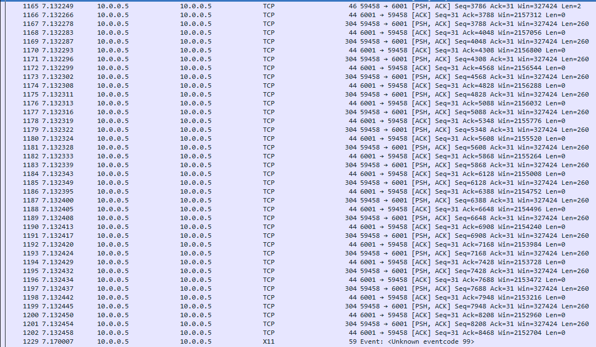

#### The second router receives the decrypted chunks from the first router:
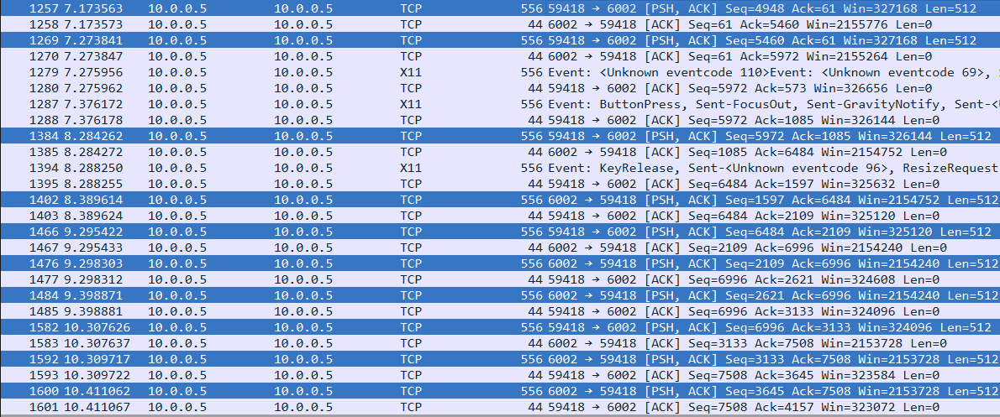

#### The last router receives its private key:
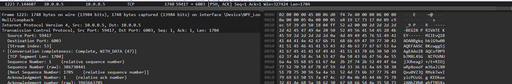

#### The router sends a success message back to the user:


- ### [CONNECTING TO SERVER]

#### last router to Server
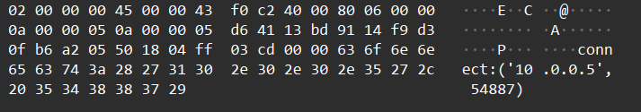

---
## Players Talking to eachother

### Chatting to eachother
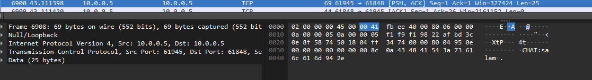

#### Players with port numbers 61945 and 61848 engage in peer-to-peer (P2P) chat:

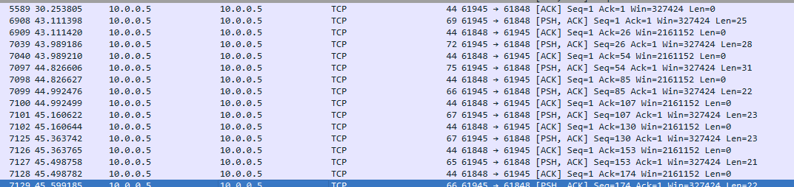

### Sending the board to eachother

#### player1 sending the board to player2 after making a move

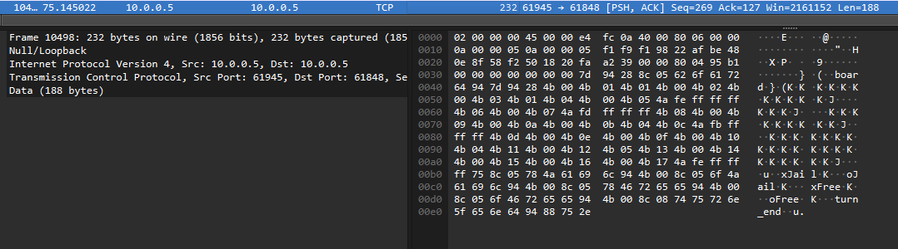 

#### using this structure
```
    game_state = {
        "board": board.myBoard,
        "xJail": board.xJail,
        "oJail": board.oJail,
        "xFree": board.xFree,
        "oFree": board.oFree,
        "turn_end": True
    }
```
---
## Rolling the Dice

#### first create a message with roll dice Protocoll

```
    choose_opoonent_msg = create_message(MessageType.ROLL_DICE.value, '')
```

#### and then encrypt it with 3 layers of encryption

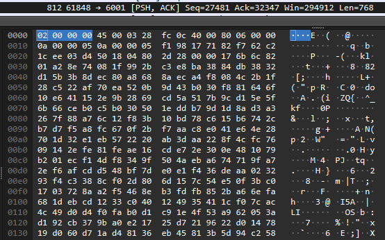

## Ending the game

When players have 15 Free pieces it will send a message with the board using a FINISHED_GAME protocoll. It well then wait for a response. The server analysis the board and sends a message to the client based on the board state.
If the game has ended the player sends a message to other player and they disconnect. 
